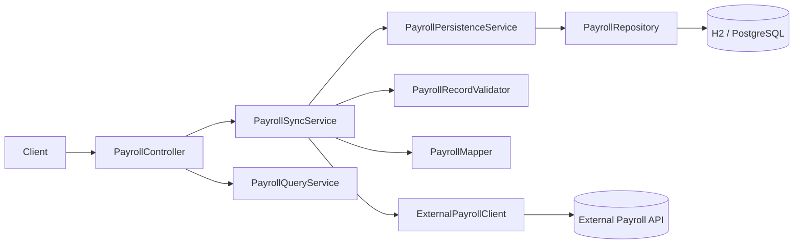

# AI-Assisted Development — Payroll Synchronization Service

**Candidate:** Pavithran Rajendran  
**Role:** Software Development Engineer (SDE-1)

---

## 1. Executive Summary

I built a small but realistic **payroll synchronization service** in **Java 17 / Spring Boot 3.3** that fetches payroll records from an external API, validates and transforms them, and persists them idempotently in a relational database. The solution emphasizes **correct transaction boundaries**, **transient-only retries**, **database-backed idempotency**, and **testable layered architecture**.

AI tools (Cursor/Claude-style assistants) were used to accelerate scaffolding, test ideas, and structured debugging—but **every critical decision was validated** with automated tests, log inspection, and framework documentation. The repository is GitHub-ready with `mvn test` passing locally.

---

## 2. Solution Overview

| Capability | Implementation |
|------------|----------------|
| Sync trigger | `POST /api/payroll/sync` |
| Query | `GET /api/payroll`, filter by `payPeriod`, `GET /api/payroll/{employeeId}` |
| External integration | `ExternalPayrollClient` → `RestExternalPayrollClient` |
| Persistence | JPA `Payroll` entity, unique `(employee_id, pay_period)` |
| Resilience | Resilience4j retry + circuit breaker |
| Validation | `PayrollRecordValidator` (skip invalid by default) |
| Errors | `GlobalExceptionHandler` + `ApiErrorResponse` |
| Observability | Spring Boot Actuator (`/actuator/health`, metrics) |
| Local mock provider | `MockExternalPayrollController` |

---

## 3. Architecture



**Sync pipeline (intentional ordering):**

1. **External API call** (no open DB transaction)
2. **Validate** each record
3. **Transform** to entity
4. **Persist** in a short, dedicated `TransactionTemplate` boundary per record

**Why:** Holding a DB transaction during a 5–8 s external call ties up pool connections and increases deadlock/timeout risk. If the API succeeds but DB fails mid-batch, you retry HTTP without losing the ability to persist remaining rows independently.

---

## 4. Project Structure

```
payroll-sync-service/
├── pom.xml
├── README.md
├── Dockerfile
├── docker-compose.yml
├── docs/
│   ├── PAPAYA_GLOBAL_SUBMISSION.md
│   ├── PAPAYA_GLOBAL_AI_PROMPTS.md
│   ├── PAPAYA_GLOBAL_REQUIREMENTS_CHECKLIST.md
│   └── examples/PayrollSyncServiceFlawed.java
└── src/main/java/com/papaya/assessment/payroll/
    ├── PayrollSyncApplication.java
    ├── client/
    ├── config/
    ├── controller/
    ├── dto/
    ├── entity/
    ├── exception/
    ├── mapper/
    ├── mock/
    ├── repository/
    └── service/
```

(Full file list: run `find . -type f ! -path './target/*'` in repo root.)

---

## 5. AI-Assisted Code Generation

### 5.1 Prompt used

See **docs/PAPAYA_GLOBAL_AI_PROMPTS.md §1** (detailed engineering prompt: Java 17, Spring Boot 3.3, layers, retries, idempotency, tests, security).

### 5.2 Initial AI-generated implementation (typical output)

AI usually produces quickly:

- A `@RestController` with `/sync` and `/payroll` endpoints
- A `RestTemplate`/`WebClient` call inside `@Transactional` service method
- JPA entity without unique constraint
- Generic `catch (Exception e)` retry loop
- Tests that mock the repository but never assert idempotency

### 5.3 Problems / limitations in AI output

| Issue | Risk |
|-------|------|
| `@Transactional` around HTTP + DB | Long-lived connections, partial failure inconsistency |
| Retry on all exceptions | Amplifies 400/validation errors |
| No unique constraint | Duplicate rows under concurrent sync |
| Logging full DTO | Sensitive payroll details in logs |
| Hallucinated Resilience4j property keys | Silent misconfiguration |
| Tests verify mock interactions only | False confidence |

### 5.4 My manual improvements

- Split **sync** vs **query** services (`PayrollSyncService`, `PayrollQueryService`)
- **RestClient** with connect/read timeouts (`RestClientConfig`)
- Classified exceptions: `ExternalApiTransientException` vs `ExternalApiClientException`
- Resilience4j retry **only** on transient types (see `application.yml`)
- Unique constraint + `PayrollPersistenceService.persistIfAbsent()` with a dedicated `TransactionTemplate`
- Skip-invalid-records strategy with summary in `SyncResultDto`
- `@RestControllerAdvice` error envelope without stack traces
- Mock external API for local deterministic demos

### 5.5 Final implementation

Production code lives under `src/main/java/com/papaya/assessment/payroll/`. Key entry points:

- `PayrollSyncService.synchronize()`
- `RestExternalPayrollClient.fetchPayrollRecords()`
- `PayrollPersistenceService.persistIfAbsent()`

---

## 6. AI for Debugging & Optimization

### 6.1 Problem scenario

Symptoms reported:

- External API **5–8 s** latency, intermittent **HTTP 503**
- Repeated sync creates **duplicate** `(employeeId, payPeriod)` rows
- Sometimes **only part** of a batch appears in DB
- Logs contain employee names and salary amounts

### 6.2 Intentionally flawed code

See `docs/examples/PayrollSyncServiceFlawed.java` (annotated anti-patterns).

### 6.3 Debugging prompt

See **docs/PAPAYA_GLOBAL_AI_PROMPTS.md §3**.

### 6.4 AI analysis (summary)

AI correctly identifies:

| Symptom | Likely root cause |
|---------|-------------------|
| Duplicates | Missing unique index + no idempotent upsert |
| Partial batch | Single transaction rollback after partial inserts **or** opposite: partial commits without summary |
| Slow sync blocking DB | Transaction spans external HTTP |
| Retry storms | Retrying 400/validation exceptions |
| PII in logs | Logging entire provider payload |

### 6.5 My validation process

I did **not** apply fixes blindly:

1. **Logs:** confirm sync summary counts vs DB `SELECT COUNT(*)`  
2. **DB:** verify unique constraint rejects second insert (`PayrollPersistenceServiceTest`)  
3. **Tests:** double `POST /sync` → `skippedDuplicate=1` and single row (`PayrollControllerIntegrationTest`)  
4. **Spring docs:** confirm each persistence transaction is isolated through `TransactionTemplate` rather than self-invocation of a transactional service  
5. **Resilience4j docs:** verify `retryExceptions` / `ignoreExceptions` lists in YAML  
6. **Runtime:** mock `mode=503` on local external API and observe retry logs + final 502

### 6.6 Fixes applied

- Removed transaction boundary around HTTP (sync service non-transactional orchestration)
- Per-record persistence with duplicate detection
- Unique constraint on entity
- Typed retry exceptions only
- Redacted logging (counts + employeeId/payPeriod only in warn paths)

### 6.7 Performance recommendations

| Topic | Recommendation |
|-------|----------------|
| Timeout | Keep read timeout below client/proxy limits (configured 8s default) |
| Pool | Hikari pool sized for concurrent HTTP workers, not unbounded threads |
| N+1 | Repository finder methods used intentionally; batch reads for listing |
| Batch insert | Use `saveAll()` when accepting all-or-nothing for a validated sub-batch |
| Pagination | Add for large `GET /api/payroll` result sets |
| Caching | Generally **not** for payroll writes; optional read cache for reporting |
| Concurrent sync | DB uniqueness + skip duplicate is sufficient at this scale; distributed lock for strict single-flight |

**Note:** Any latency numbers in discussions are **illustrative** unless measured in your environment.

---

## 7. AI for Testing & Code Quality

### 7.1 Test-generation prompt

See **docs/PAPAYA_GLOBAL_AI_PROMPTS.md §7**.

### 7.2 Test suite (what important tests validate)

| # | Scenario | Test | Asserts |
|---|----------|------|---------|
| 1 | Successful sync | `PayrollControllerIntegrationTest.syncAndListPayroll` | persisted=1, GET returns data |
| 2 | Empty API | `PayrollSyncServiceTest.handlesEmptyApiResponse` | no persistence calls |
| 3 | Timeout | `RestExternalPayrollClient` + `ResourceAccessException` path | classified transient (via integration/manual) |
| 4 | HTTP 503 | `RestExternalPayrollClientTest.mapsHttp503ToTransientException` | fail-fast classification |
| 5 | HTTP 429 | Same pattern as 503 in client `onStatus` | transient |
| 6 | HTTP 400 | `RestExternalPayrollClientTest.mapsHttp400ToClientException` | no retry |
| 7 | Malformed JSON | Client generic parse → `ExternalApiException` | 502 at controller |
| 8 | Invalid employee ID | `PayrollRecordValidatorTest` | violation message |
| 9 | Invalid salary | `PayrollRecordValidatorTest.rejectsNegativeSalary` | |
| 10 | net > gross | `PayrollRecordValidatorTest.rejectsNetSalaryGreaterThanGross` | |
| 11 | Duplicate key | `PayrollControllerIntegrationTest.duplicateSyncIsIdempotent` | skippedDuplicate |
| 12 | DB failure | `PayrollPersistenceService` returns `FAILED` (extend with mocked repo if needed) | partial progress |
| 13 | Not found | `PayrollControllerIntegrationTest.employeeNotFoundReturns404` | error code |
| 14 | GET all | integration test | 200 + array |
| 15 | GET employee | integration test | employee filter |
| 16 | Filter period | `filterByPayPeriod` | query param |

### 7.3 Edge-case matrix

| Edge case | Expected behavior |
|-----------|-------------------|
| Empty API response | `200`, summary zeros, DB unchanged |
| Duplicate record | `skippedDuplicate++`, DB unchanged |
| Same employee, different period | Two rows allowed |
| Malformed JSON | `502 EXTERNAL_API_ERROR` |
| Null fields | Validation skip or fail-fast (config) |
| Negative salary | Skipped invalid |
| tax > gross | Skipped invalid |
| net salary mismatch vs gross-tax | Not enforced (provider truth); could add warning metric |
| Unsupported currency | Skipped invalid |
| External timeout | Retry then 502 |
| Rate limit 429 | Retry with backoff |
| Repeated sync | Idempotent skips |
| DB unavailable | `failed++` / 5xx on read endpoints |
| Partial batch failure | Valid rows committed per-record |
| Large batch | Consider batch insert; watch memory |
| Concurrent sync | Unique constraint prevents duplicates |

### 7.4 Refactoring examples

**Before (AI-style monolith):**

```java
@Transactional
public void sync() {
    var data = client.fetch();
    for (var row : data) {
        repo.save(map(row));
    }
}
```

**After (this project):**

```java
public SyncResultDto synchronize() {
    List<ExternalPayrollRecordDto> fetched = externalPayrollClient.fetchPayrollRecords();
    for (ExternalPayrollRecordDto record : fetched) {
        // validate → persistIfAbsent uses a dedicated TransactionTemplate boundary
    }
}
```

### 7.5 Quality improvements

- Constructor injection throughout
- DTO records for immutability
- Separate read/write services
- Configuration via `@ConfigurationProperties` records

---

## 8. Reliability & Data Consistency

| Mechanism | Purpose |
|-----------|---------|
| **Timeout** | Fail fast; release threads |
| **Retry** | Recover transient provider faults (429/5xx/network) |
| **Circuit breaker** | Protect provider and local resources after failure burst |
| **Fallback** | Return controlled 502 instead of hanging |
| **Idempotency** | Business key + unique index |
| **Transactions** | Short, per-record writes |
| **Skip invalid** | Avoid blocking entire payroll window |

**Why not retry HTTP 400:** it indicates a client/request problem; retrying wastes capacity and can trigger rate limits without ever succeeding.

**Unique constraint:** last line of defense when two sync threads both pass the existence check (race).

---

## 9. AI in My Development Workflow

1. **Requirements** — AI summarizes acceptance criteria into a checklist  
2. **Codegen** — scaffold layers; I edit transaction and error model  
3. **Codebase understanding** — “where is X wired?” questions before changing behavior  
4. **Debugging** — paste stack traces; I reproduce locally  
5. **Tests** — AI drafts cases; I remove brittle mock-verification tests  
6. **Refactoring** — AI suggests extractions; I keep diff minimal  
7. **Code review** — AI flags missing indexes; I confirm with EXPLAIN only when needed  
8. **Learning** — unfamiliar annotations with tiny examples  
9. **SQL** — draft queries; validate against schema  
10. **API design** — idempotency and status code discussion  
11. **Docs** — README structure, not copy-paste truth  
12. **Production issues** — log + metric guided hypotheses, AI narrates patterns  

**Tools:** Cursor agent, ChatGPT/Claude for ad-hoc questions, Copilot for boilerplate in IDE.

**Human validation:** tests, logs, DB state, security review, official docs, final merge decision by me.

---

## 10. AI Limitations and Responsible Usage

AI may hallucinate APIs, misconfigure retries, suggest `@Transactional` on the wrong layer, or generate tests that assert implementation. Mitigation:

- Compile + `mvn test` on every change  
- Cross-check Spring/Resilience4j configuration in official docs  
- Prefer behavior assertions over `verify(mock, times(1))`  
- Never commit secrets suggested in prompts  
- Treat AI performance claims as hypotheses until benchmarked  

---

## 11. Key Technical Decisions

1. **200 vs 202 for sync:** synchronous summary → **200**; async job queue would use **202** + status URL  
2. **Skip invalid records:** realistic payroll feeds; configurable strict mode  
3. **Resilience4j vs manual retry:** declarative, metrics-friendly  
4. **H2 default / Postgres optional:** fast assessment setup, production-like profile available  
5. **Mock external controller:** deterministic demo of failure modes  

---

## 12. Conclusion

This project demonstrates how I use AI as an **accelerator** while applying senior-style judgment on **consistency, idempotency, and failure isolation**. The codebase is small, readable, and test-backed—appropriate for SDE-1 while showing production-minded habits valued at Papaya Global.

---

## Senior Review — Issues Found and Fixed

| Finding | Fix |
|---------|-----|
| Test DB not isolated between classes | `@BeforeEach deleteAll()` in persistence test |
| Duplicate field assignment in sync service ctor | Removed redundant assignment |
| Unused `ObjectMapper` in client | Removed |
| `SyncResultDto` missing failed count | Added `failed` field |
| Mock path alignment | `base-url` + `records-path` documented in README |
| HTTP 429 classified as generic 4xx (no retry) | Handle 429 before other 4xx handlers in `RestExternalPayrollClient` |
| H2 console exposed in default profile | Disabled by default and enabled only in the dedicated `dev` profile |
| Security role enforcement | Sync endpoint requires the configured `SYNC_ADMIN` role |
| Runtime resilience proof | Added retry, non-retry, and circuit-breaker tests |

**Verified:** `mvn clean test` passes 36 tests with 0 failures and 0 errors.

---

## Appendix: HTTP status for sync

- **200 OK** — sync completed in-request; body contains operational summary  
- **202 ACCEPTED** — preferred when work is delegated to background processor  

This implementation uses **200** because sync is synchronous; document explains when to evolve to **202**.
